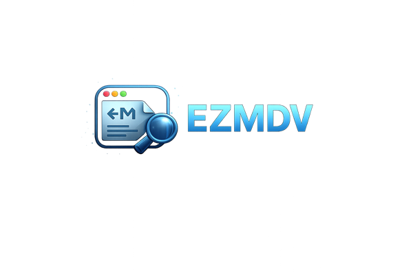
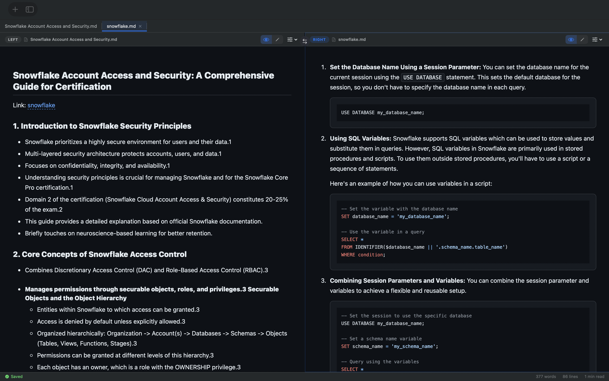
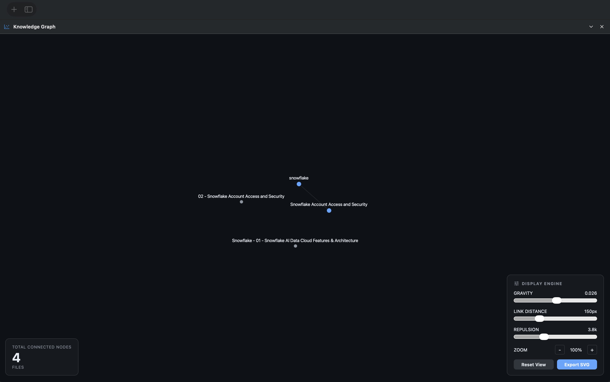

<p align="center">
  
</p>

<h1 align="center">ezmdv</h1>

<p align="center">
  <strong>A native macOS markdown viewer & editor</strong><br>
  Built with SwiftUI + WKWebView — no Xcode project, no Apple Developer account required.
</p>

<p align="center">
  
  
  
</p>

---

## Features

### Viewing & Editing
- **Markdown rendering** with syntax highlighting (highlight.js), math (KaTeX), diagrams (Mermaid), and GFM support
- **CodeMirror 6 editor** with syntax highlighting, line numbers, and markdown-specific features
- **Live preview** — side-by-side editor + rendered output
- **Slash commands** in editor: `/h1`, `/code`, `/table`, `/task`, and more
- **Auto-save** with dirty file indicator (3s debounce)
- **Auto-scroll (teleprompter mode)** — hands-free reading with adjustable speed
- **Export to HTML** — standalone file with all styling baked in (⌘⇧E)

### Navigation & Discovery
- **Wiki-links** — `[[file]]`, `[[file|alias]]`, `[[file#heading]]` with click-to-navigate
- **Backlinks panel** — see which files reference the current document, with unlinked mention detection and one-click linking
- **Wiki-link-aware rename** — renaming a file automatically updates all `[[links]]` across the project
- **Command palette** (⌘K) — fuzzy search across files and actions (Tab or Enter to select)
- **Knowledge graph** (⌘⌥G) — immersive space-themed visualization with animated physics
  - Pulsing, glowing nodes with cosmic color palette
  - Twinkling star background with nebula gradients
  - Hover preview panel (3s) with rendered markdown, collapsible headers, and expand/collapse
  - Pin nodes by dragging, double-click to unpin
  - Display engine controls: gravity, link distance, repulsion
  - Filter by search, orphan status, or folder
  - Clean SVG export with proper viewBox and inlined styles
- **Orphan finder** — detect notes with no incoming or outgoing links
- **Table of contents** panel extracted from headings

### Project Management
- **Multi-project sidebar** with file tree and sort options (name, date, size)
- **Tab bar** with tab persistence across sessions, pinned tabs
- **Split view** — compare two files side by side (⌘\\)
- **File operations** — create, rename, delete, move files and folders
- **Move to...** — relocate files/folders via context menu with folder picker
- **Search** across all projects (filename + content, uses in-memory cache)
- **Focus mode** — hide sidebar, tabs, and status bar for distraction-free writing (Esc to exit)
- **Tag system** — `#tag` detection with tag filter panel in sidebar
- **Daily notes** — quick-create and navigate daily journal entries
- **Templates** — create files from project-specific templates

---

## Screenshots

<p align="center">
  
  <br><em>Split view with markdown editor and live preview</em>
</p>

<p align="center">
  
  <br><em>Interactive knowledge graph with display engine controls</em>
</p>

---

## Download

**[Download ezmdv v1.0.0 (DMG)](https://github.com/bruno-rv/ezmdv-mac/releases/download/v1.0.0/ezmdv-1.0.0.dmg)** — open the DMG and drag ezmdv to your Applications folder.

Or build from source below.

---

## Build & Install

### Prerequisites

- **macOS 14+** (Sonoma or later)
- **Swift 5.9+** (included with Xcode 15+ or available via `xcode-select --install`)
- **Node.js** (for building the CodeMirror editor bundle)

### Quick Start

```bash
git clone https://github.com/bruno-rv/ezmdv-mac.git
cd ezmdv-mac
bash scripts/build.sh
```

The build script will:
1. Install npm dependencies and bundle CodeMirror via esbuild
2. Compile the Swift project with `swift build`
3. Create an `ezmdv.app` bundle in `dist/`
4. Package a `ezmdv.dmg` disk image

To run the app directly after building:

```bash
open dist/ezmdv.app
```

Or drag `ezmdv.app` from the DMG to your Applications folder.

---

## Architecture

```
ezmdv-native/
├── Package.swift              # Swift Package Manager manifest
├── Sources/EzmdvApp/
│   ├── EzmdvApp.swift         # App entry point, keyboard shortcuts
│   ├── Models/
│   │   ├── AppState.swift          # Central state + wiki-link index
│   │   ├── AppState+Projects.swift # Project/file CRUD, wiki-link rename
│   │   ├── AppState+FileContent.swift # Content cache, auto-save
│   │   ├── AppState+Persistence.swift # State save/restore
│   │   ├── AppState+Tabs.swift     # Tab management
│   │   ├── Project.swift           # Project & file tree model
│   │   ├── SavedState.swift        # Persistent state (JSON)
│   │   └── Tab.swift               # Tab model
│   ├── Views/
│   │   ├── ContentView.swift      # Main layout: sidebar + detail
│   │   ├── SidebarView.swift      # Project file tree
│   │   ├── TabBarView.swift       # Tab bar with dirty indicators
│   │   ├── MarkdownPaneView.swift # Toolbar + webview + panels
│   │   ├── MarkdownWebView.swift  # WKWebView bridge (render/edit)
│   │   ├── PaneToolbar.swift      # View mode toggle, panels
│   │   ├── CommandPalette.swift   # Fuzzy file/action search (⌘K)
│   │   ├── BacklinksView.swift    # Incoming wiki-link references
│   │   ├── GraphView.swift        # Canvas-based knowledge graph (space theme)
│   │   ├── OrphanFinderView.swift # Orphan note detection
│   │   ├── TOCView.swift          # Table of contents panel
│   │   ├── StatusBar.swift        # Word count, save state
│   │   ├── FindBar.swift          # Find & replace bar
│   │   ├── SplitContentView.swift # Side-by-side file comparison
│   │   └── FileTreeView.swift     # Recursive file tree component
│   ├── Services/
│   │   ├── FileService.swift      # File CRUD + move operations
│   │   ├── FileScanner.swift      # Recursive directory scanner
│   │   ├── FileWatcher.swift      # FSEvents file monitoring
│   │   ├── SearchService.swift    # Full-text search (cache-aware)
│   │   ├── TagService.swift       # #tag extraction and indexing
│   │   ├── TemplateService.swift  # File template support
│   │   ├── DailyNoteService.swift # Daily note creation
│   │   └── ExportService.swift    # HTML + static site export
│   └── Resources/
│       ├── markdown.html      # Render/edit host page (inlined CSS)
│       ├── markdown.css        # Base styles (referenced by export)
│       ├── marked.min.js       # Markdown parser library
│       └── editor.js           # CodeMirror 6 bundle (built from npm)
├── Sources/EzmdvCore/
│   ├── WikiLinkIndex.swift     # Pure-logic wiki-link index (backlinks, outgoing)
│   ├── TagExtractor.swift      # #tag extraction from markdown
│   ├── DailyNoteLogic.swift    # Date-based note path logic
│   └── LRUCache.swift          # Generic LRU cache
├── resources/
│   ├── editor-src.js          # CodeMirror source (pre-bundle)
│   └── package.json           # npm deps for editor build
├── assets/
│   ├── AppIcon.icns           # macOS app icon
│   └── icon.png               # Icon source image
└── scripts/
    └── build.sh               # Build + bundle + DMG script
```

The app uses a **hybrid rendering** approach: SwiftUI provides the native shell (sidebar, tabs, toolbar, overlays), while a WKWebView handles markdown rendering and the CodeMirror editor. Communication flows through `WKScriptMessageHandler` (JS → Swift) and `evaluateJavaScript` (Swift → JS).

---

## Keyboard Shortcuts

| Shortcut | Action |
|----------|--------|
| ⌘K | Command palette |
| ⌘S | Save file |
| ⌘E | Toggle edit mode |
| ⌘P | Toggle live preview |
| ⌘\\ | Split view |
| ⌘⌥G | Knowledge graph |
| ⌘⇧E | Export to HTML |
| ⌘⇧D | Toggle dark mode |
| ⌘F | Find in file |
| ⌘G | Find next |
| ⌘⇧G | Find previous |
| Esc | Exit focus mode / close graph |

---

## Contact

Questions, suggestions, or feedback? Reach out at **brunorv@hotmail.com**.

---

## License

MIT License — see [LICENSE](LICENSE) for details.
